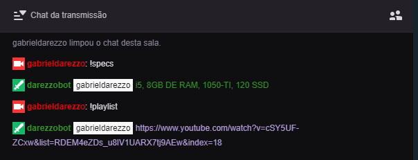

# TwitchBot


## Exemplo:


## Como rodar na sua maquina

Instale o Node:
https://nodejs.org/en/download/


Crie uma conta Bot no http://twitch.tv

Faça um clone do repositorio:
```shell
git clone https://github.com/gabrieldarezzo/twitchbot.git
npm run start
```

Seria legal usar o NightBot junto.  
https://docs.nightbot.tv/commands/commandlist  
Assim possibilita comandos como:
* Mudar o nome da Live
* Muda a categoria
* Muda o game  

Para criar funcionalidades pode usar os comandos do of [tmi.js](https://github.com/tmijs/tmi.js):
  
https://github.com/tmijs/docs/blob/gh-pages/_posts/v1.4.2/2019-03-03-Commands.md#mods


Você precisa criar um arquivo `password.js`:  
```js
exports.password = '{YOUR_TOKEN_GOES_HERE}'
```  

Agora você precisa da sua conta bot.
Troque o `{YOUR_TOKEN_GOES_HERE}` pelo `Token TMI(IRC)`, você pode gerar um token aqui:
http://twitchapps.com/tmi


# Transformar seu bot em /mod
É bacana deixar seu Bot como /mod, assim ele fica com este icon:  
 NOME_DO_BOT  

Para isso apenas execute no chat:
```
/mod {NOME_DO_SEU_BOT}
```

# Criar seus proprios comandos:
Apenas adicione uma linha no arquivo `commands.js`: 

```json
module.exports = {
    "!twitter":"https://twitter.com/gabrieldarezzo",
    "!github":"https://github.com/gabrieldarezzo",
    "!email":"darezzo.gabriel@gmail.com",
    "!specs":"i5, 8GB DE RAM, 1050-TI, 120 SSD",    
    "!linkprojeto":"https://github.com/gabrieldarezzo/twitchbottwitch",
    "!LINK_DO_COMANDO":"VALOR A SER EXIBIDO",
};
```  

Comandos padrões da twitch:
```
/help
/w
/me
/disconnect
/mods
/vips
/color
/user
/commercial
/mod
/unmod
/vip
/unvip
/ban
/unban
/timeout
/untimeout
/slow
/slowoff
/r9kbeta
/r9kbetaoff
/emoteonly
/emoteonlyoff
/clear
/subscribers
/subscribersoff
/followers
/followersoff
/host
/unhost
/raid
/unraid
/marker

```
Mais comandos do twitch: https://help.twitch.tv/s/article/chat-commands